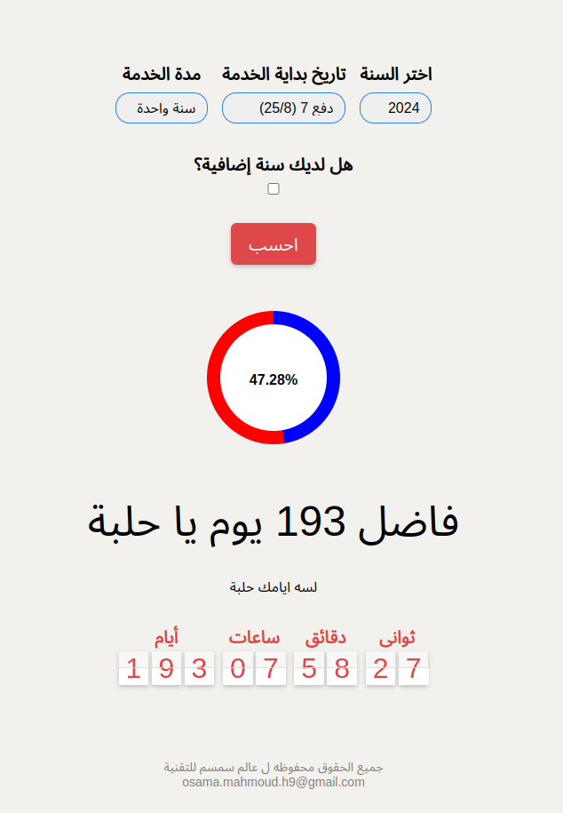
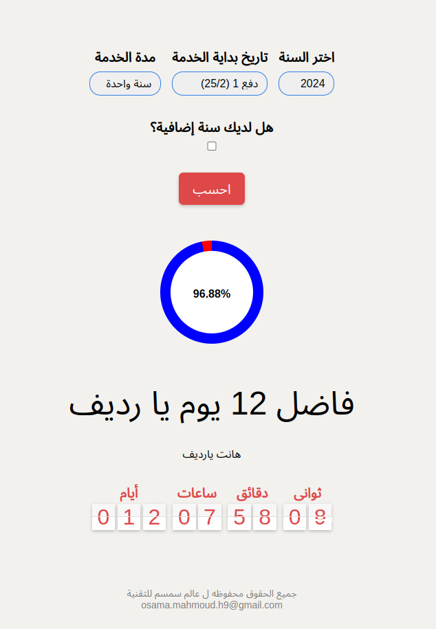

# military-service-calculator
## Description
This is a simple calculator that calculates the total number of days a person has served in the military. It takes the start date and end date of the service and calculates the total number of days served. It also calculates the total number of days served in each year. The calculator takes into account the leap years and the number of days in each month. The calculator is written in JavaScript and uses the datetime module to calculate the total number of days served. The calculator is useful for people who want to know the total number of days they have served in the military. It can be used by both active duty and reserve military personnel. The calculator is easy to use and provides accurate results. It is a useful tool for anyone who wants to know the total number of days they have served in the military.

## Description in Arabic:
هذه آلة حاسبة بسيطة تحسب إجمالي عدد الأيام التي قضاها الشخص في الخدمة العسكرية. يأخذ تاريخ البدء وتاريخ الانتهاء للخدمة ويحسب إجمالي عدد الأيام المقدمة. كما أنه يحسب إجمالي عدد أيام الخدمة في كل عام. تأخذ الآلة الحاسبة في الاعتبار السنوات الكبيسة وعدد الأيام في كل شهر. الآلة الحاسبة مكتوبة بلغة جافا اسكربت وتستخدم وحدة التاريخ والوقت لحساب إجمالي عدد الأيام التي يتم تقديمها. الآلة الحاسبة مفيدة للأشخاص الذين يريدون معرفة العدد الإجمالي للأيام التي قضوها في الخدمة العسكرية. ويمكن استخدامه من قبل كل من الأفراد العسكريين العاملين والاحتياطيين. الآلة الحاسبة سهلة الاستخدام وتوفر نتائج دقيقة. إنها أداة مفيدة لأي شخص يريد معرفة العدد الإجمالي للأيام التي قضاها في الخدمة العسكرية. 

### go to preview
[helpah-calculator](https://htmlpreview.github.io/?https://github.com/osama-mahmoud-h/military-service-calculator/blob/master/calculator.html)

#### image of the calculator:

